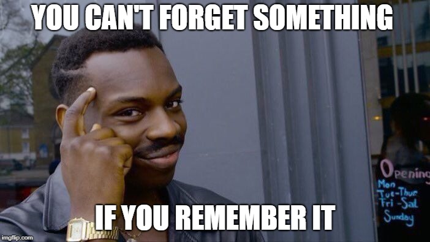

# Lesson PABLO

Before we get started
* Installing IDE; in this case vscode
* Making sure a python interpreter is installed and on the path
* Making sure jupyter notebook is installed

## Lesson 1: The file system and text files

Do you know how a file system works?

* File (fr. dossier)
* Folder (fr. fichier)

A file is a resource of recording data on your hard drive. Your OS (Windows or MacOS) hat programs that show files in a list for you. These files can be arranged into folders. We'll look at it together.

Computer files contain numbers. Computer store numbers as ones and zeros. A one or a zero is called a **bit**. A sequence of 8 ones or zeroes is called a **byte**. **The smallest space the computer can remember is the byte.** This is why the **size of files** is is measured in the amount of bytes in them. Because files can get pretty big we like to use modifiers like 'kilo'.

```plaintext
kilo: 1000 (abbrev. 'k')
mega: 1.000.000 (abbrev. 'M')
giga: 1.000.000.000 (abbrev. 'G')
tera= 1.000.000.000.000 (abbrev. 'T')
```

The abbreviation is byte is 'B'. This is why you will see the file size written as `kB', 'MB' or 'GB'.

```
1 kB = 1000 B
1 MB = 1000 kB = 1.000.000 B
1 GB = 1000 MB = 1.000.000 kB = 1.000.000.000 B

Text files are like a 100kB
A picture is typically about 5MB.
A video can range between 100MB to 20GB.
```

When the bytes in computer files don't have any meaning to humans, i.e. they cannot be read like tekst, we call them **binary**.

Examples of binary files:
* Computer programs
* Images
* Video
* Sound

So a lot of the files on your PC cannot be read by humans; only computer programs. But we can use a list of definitions to appoint a letter to each byte. We call this **encoding**. The simplest one is called ASCII. A part of it looks like this.

```plaintext
01100001 <-> 'a'
01100010 <-> 'b'
01100011 <-> 'c'
01100100 <-> 'd'
01100101 <-> 'e'
01100110 <-> 'f'
01100111 <-> 'g'
01101000 <-> 'h'
01101001 <-> 'i'
01101010 <-> 'j'
01101011 <-> 'k'
01101100 <-> 'l'
01101101 <-> 'm'
01101110 <-> 'n'
01101111 <-> 'o'
01110000 <-> 'p'
01110001 <-> 'q'
01110010 <-> 'r'
01110011 <-> 's'
01110100 <-> 't'
01110101 <-> 'u'
01110110 <-> 'v'
01110111 <-> 'w'
01111000 <-> 'x'
01111001 <-> 'y'
01111010 <-> 'z'
00001010 <-> Line feed character that makes a teletype machine make a new line
00001101 <-> Carriage return character that make a teletype machine move the carriage back to the left
00000111 <-> Make a machine ring a bell! 'PING'
```

As you can see not every byte is an alphabet letter. Some of them have only meaning to computers. Like the teletype machines of old:


When a letter is assigned to each byte we can use files to save tekst. For fun. If we save the string `Pablo' on your hard drive using ASCII encoding the actual bytes will look like this:

```
0101000001100001011000100110110001101111
```

So another way of looking at a file is a HUGE number. Or a little more clearly:
```
01010000 01100001 01100010 01101100 01101111
P        a        b        l        o
```

When a file is full of bytes that form a text when you add encoding this is called a **text file**. All the files you will write as a programmer is a text file. In fact, this readme was written as a text file. More complex encodings exist so you can write more characters like 'é'. ASCII only has 127 characters. But don't worry about that for now.

One more thing. A new line has a special character. If you want to add a new line to the text this is the byte that signifies that:

```Line feed character (LF):       00001010```

But on windows a new line requires another character called a carriage return:

```Carriage return character (CR): 00001101```


Now on WINDOWS we use TWO characters to make a new line in a text file: CR + LF.
On MacOS and LINUX we use ONE character to make a new line in a text file: LF.

So if you open a text file made on Linux or MacOS on a Windows machine things can break. VSCode is smart enough on Windows but other programs are not and they can crash if you try to open a text file without CR characters on Windows.

So when you are **programming** you will make a **folder** and make **text files** in that folder using your **text editor** (IDE in this case). 

**Python code is just text and it is read by a computer program called the Python interpreter.**



This may seem silly but I get high school students that DON'T KNOW WHAT A FILE IS! That's the cause of so much trouble and misery.


## Lesson 2 - The Python programming language

Open Jupyter notebook for the first lesson in the folder 'lesson-1'.


