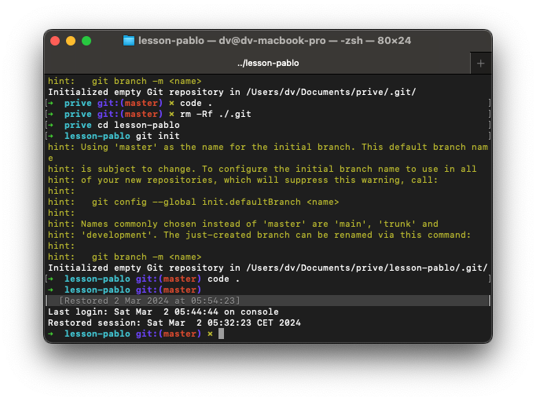
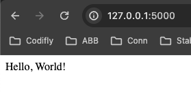

# Lesson 3: My first program and libraries

So far we used a technology used Jupyter notebook to execute snippets of code. If you want to write a Python program to distribute to others you have to write a text file with the `.py` extension. 

## Making and running python code

The python interpreter is a program on your PC. But unlike some of the programs you are used to you need to run python using the terminal. MacOS and windows have different terminals.

* Windows: command prompt or powershell
* MacOS: terminal (zshell)

This is what my terminal looks like.



You can use the command prompt to run programs that have no user interface. You control them with text inputs and read their text outputs. The definition of the commands that a computer program understands in text is called the 'command line interface'(CLI).

The Python interpreter is such a program. Let's try running a program. Make a text file called `main.py`

```python
def main():
  print('Hello world!')

main()
```

Feel free to change it if you want.

Then in open the terminal in the same folder and type:

```bash
python main.py
```

And the output of the program will show.

Now try the calculator from before. Put this into `main.py`:

```python
a_text = input('First number: ')
b_text = input('Second number: ')
print('The sum is: ' + str(int(a_text) + int(b_text)))
```

And run it. Does it work?

Congratulations. You just made your first Python program.

## Libraries

Libraries consist of python files other people have made. You can use them in your code using the `import` keyword. You have to download these python files first though.

Lets install a library called flask. Run this in the terminal:

```bash
pip install flask
```

Now you can use the flask library. Make a file called `server.py` and put this code in it:

```python
from flask import Flask
app = Flask(__name__)

@app.route('/')
def hello_world():
    return 'Hello, World!'
```

Now run it in the terminal by typing

Windows:
```
set FLASK_APP=server
flask run
```

MacOS
```bash
export FLASK_APP=server
flask run
```

Pip also installed a little command line tool for us you invoke by running `flask` in the terminal. Don't worry. It only performs some config before it runs your python code using the good old python interpreter.

You should see an output like this along with some other stuff:

```
 * Running on http://127.0.0.1:5000
```

Now to go the browser and navigate to `http://127.0.0.1:5000`

You'll get this:



The python program you just wrote is a web server and the Flask library makes it easy for you. It listens on the port 5000 on your PC. `127.0.0.1` is a standard IP address the always just points to your own PC. You just surfed to a website that is hosted on your own PC.

Press CTRL + C in the terminal to stop the server when you're done.


